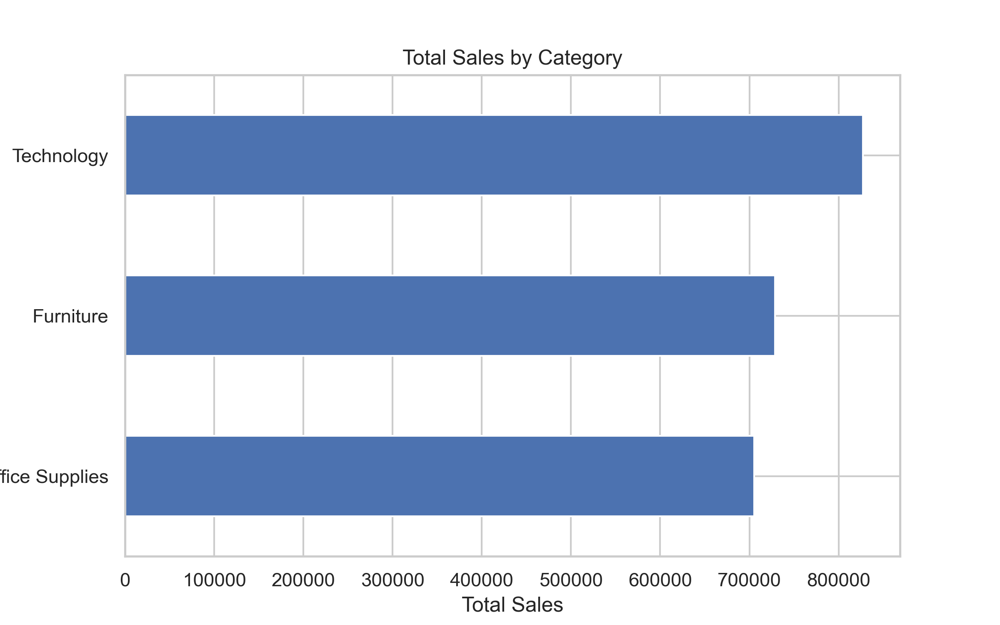
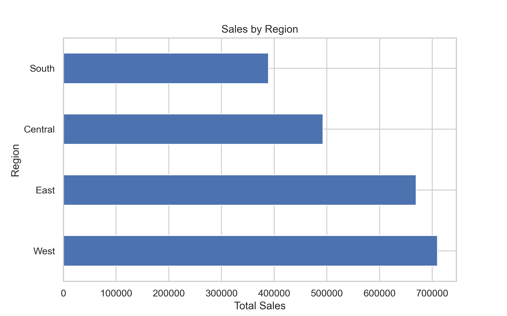
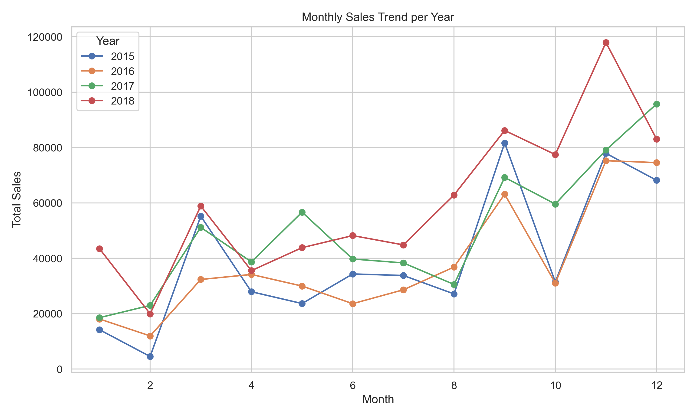

# 📊 Sales Performance Analysis

---

# 🇮🇩 Bahasa Indonesia

## 📌 Project Overview

Project ini bertujuan untuk menganalisis performa penjualan perusahaan menggunakan pendekatan Exploratory Data Analysis (EDA).  
Analisis dilakukan untuk memahami pola revenue, kontribusi kategori, tren musiman, dan efisiensi pengiriman.

---

## 📂 Dataset

Dataset berisi informasi transaksi penjualan, termasuk:

- Order Date
- Ship Date
- Sales
- Category
- Sub-Category
- Region
- Segment
- Ship Mode

Fitur tambahan yang dibuat:
- Year
- Month
- Shipping Duration (hari)

---

## 📊 Visualisasi yang Ditampilkan

Berikut grafik utama yang digunakan dalam analisis:

---

### 1️⃣ Total Sales per Category
📌 Menunjukkan kategori dengan kontribusi revenue terbesar.



---

### 2️⃣ Sales per Region
📌 Menunjukkan distribusi penjualan antar wilayah.



---

### 3️⃣ Sales Trend per Year
📌 Menunjukkan pertumbuhan penjualan tahunan.


---

### 4️⃣ Yearly Growth Rate
📌 Menunjukkan pertumbuhan Year-over-Year (%).


---

### 5️⃣ Monthly Trend & Seasonality
📌 Menunjukkan pola musiman (peningkatan signifikan pada Q4).



---

### 6️⃣ Shipping Duration Distribution
📌 Menganalisis efisiensi pengiriman (rata-rata ±4 hari).


---

### 7️⃣ Sales Distribution & Outlier Detection
📌 Analisis distribusi dan deteksi outlier menggunakan boxplot.


---

## 🔎 Key Business Insights

1. Technology adalah driver utama revenue.
2. Region West memiliki performa terbaik.
3. Terdapat seasonality kuat pada Q4.
4. Rata-rata shipping duration ±4 hari dapat mempengaruhi cash flow.

---

## 💡 Business Recommendation

- Optimasi inventory menjelang Q4.
- Fokus marketing di region dengan penjualan rendah.
- Evaluasi efisiensi logistik untuk mempercepat cash cycle.
- Pertahankan strategi pada kategori Technology.

---

## 🛠 Tools & Technologies

- Python
- Pandas
- Matplotlib
- Seaborn
- Jupyter Notebook

---


## 📁 Project Structure
```
retail_sales_performance_analysis/
│
├── Superstore_Sales_EDA.ipynb      # Jupyter Notebook berisi proses analisis
├── README.md                       # Dokumentasi proyek
└── images/                         # Folder visualisasi hasil analisis
    ├── sales_by_category.png
    ├── sales_by_region.png
    ├── sales_by_year.png
    ├── yearly_growth.png
    ├── monthly_seasonality.png
    ├── shipping_duration.png
    └── sales_boxplot.png
```
---


# 🇬🇧 English Version

## 📌 Project Overview

This project analyzes company sales performance using Exploratory Data Analysis (EDA).  
The objective is to understand revenue trends, category contribution, seasonality, and shipping efficiency.

---

## 📂 Dataset

The dataset contains transaction-level sales data, including:

- Order Date
- Ship Date
- Sales
- Category
- Sub-Category
- Region
- Segment
- Ship Mode

Engineered Features:
- Year
- Month
- Shipping Duration (days)

---

## 📊 Visualizations Included

---
---

### 1️⃣ Total Sales per Category
📌 Menunjukkan kategori dengan kontribusi revenue terbesar.


---

### 2️⃣ Sales per Region
📌 Menunjukkan distribusi penjualan antar wilayah.


---

### 3️⃣ Sales Trend per Year
📌 Menunjukkan pertumbuhan penjualan tahunan.


---

### 4️⃣ Yearly Growth Rate
📌 Menunjukkan pertumbuhan Year-over-Year (%).


---

### 5️⃣ Monthly Trend & Seasonality
📌 Menunjukkan pola musiman (peningkatan signifikan pada Q4).


---

### 6️⃣ Shipping Duration Distribution
📌 Menganalisis efisiensi pengiriman (rata-rata ±4 hari).


---

### 7️⃣ Sales Distribution & Outlier Detection
📌 Analisis distribusi dan deteksi outlier menggunakan boxplot.


---

## 🔎 Key Business Insights

1. Technology is the main revenue contributor.
2. West region outperforms other regions.
3. Strong Q4 seasonality.
4. Shipping duration impacts cash flow cycle.

---

## 💡 Business Recommendations

- Increase inventory before Q4.
- Improve marketing strategy in underperforming regions.
- Optimize logistics to improve cash cycle.
- Maintain strong positioning in Technology category.

---

## 🛠 Tools & Technologies

- Python
- Pandas
- Matplotlib
- Seaborn
- Jupyter Notebook

---

## 📁 Project Structure
```
retail_sales_performance_analysis/
│
├── Superstore_Sales_EDA.ipynb      # Jupyter Notebook containing full analysis
├── README.md                       # Project documentation
└── images/                         # Visualization outputs
    ├── sales_by_category.png
    ├── sales_by_region.png
    ├── sales_by_year.png
    ├── yearly_growth.png
    ├── monthly_seasonality.png
    ├── shipping_duration.png
    └── sales_boxplot.png
```
